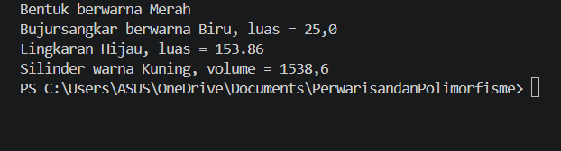

# 🌸 TUGAS PBO — INHERITANCE & POLYMORPHISM 🌸

<div align="center">

  
  
  

**✨ Pemrograman Berorientasi Objek ✨**

*Belajar memahami konsep pewarisan dan polimorfisme menggunakan Java.*

💗 ━━━━━━━━━━━━━━━━━━━━━━━━━━━━━ 💗

</div>

## 👩🏻‍💻 Identitas Mahasiswa

| 📝 Keterangan   | 💖 Informasi                         |
| :-------------- | :----------------------------------- |
| **Nama**        | Rila Yayu Wahyuningsih               |
| **NIM**         | F1D02510024                          |
| **Kelas**       | 3B                                   |
| **Mata Kuliah** | Pemrograman Berorientasi Objek (PBO) |
| **Topik**       | Inheritance dan Polymorphism         |

---

## 🎯 Deskripsi Program

Program ini dibuat untuk memenuhi tugas mata kuliah **Pemrograman Berorientasi Objek (PBO)** dengan menerapkan dua konsep utama dalam pemrograman berorientasi objek, yaitu:

* 🌳 **Inheritance (Pewarisan):** mekanisme pewarisan atribut dan method dari kelas induk kepada kelas turunannya.
* 🎭 **Polymorphism (Polimorfisme):** kemampuan objek untuk memberikan perilaku berbeda melalui pemanggilan method yang sama.

Program ini menggunakan beberapa kelas yang merepresentasikan bentuk geometri, yaitu `Bentuk`, `BujurSangkar`, `Lingkaran`, dan `Silinder`.

---
## 🖼️ Hasil Program

<div align="center">



*✨ Dokumentasi hasil eksekusi program Java ✨*

</div>

---

## 📂 Struktur File Program

Berikut merupakan struktur file Java yang digunakan dalam program ini.

| 📄 Nama File        | 📌 Keterangan                                                                           |
| :------------------ | :-------------------------------------------------------------------------------------- |
| `Bentuk.java`       | 🟣 Kelas induk (*superclass*) yang menyimpan atribut warna dan method informasi bentuk. |
| `BujurSangkar.java` | 🟦 Kelas turunan untuk menghitung luas bujur sangkar.                                   |
| `Lingkaran.java`    | 🟢 Kelas turunan untuk menghitung luas lingkaran.                                       |
| `Silinder.java`     | 🟡 Kelas turunan dari `Lingkaran` untuk menghitung volume silinder.                     |
| `Main.java`         | 🔴 Kelas utama untuk membuat objek dan menjalankan program.                             |

### 🌳 Hierarki Inheritance

```text
              Bentuk
             /      \
            /        \
   BujurSangkar     Lingkaran
                         |
                         |
                      Silinder
```

📌 Pada struktur tersebut, `BujurSangkar` dan `Lingkaran` mewarisi kelas `Bentuk`, sedangkan `Silinder` mewarisi kelas `Lingkaran`.

---

## 🚀 Cara Menjalankan Program

Pastikan Java Development Kit (JDK) sudah terinstal pada komputer kamu.

**1️⃣ Kompilasi seluruh file Java**

Buka terminal pada folder program, lalu jalankan:

```bash
javac *.java
```

**2️⃣ Jalankan program**

```bash
java Main
```

**3️⃣ 🎉 Lihat hasilnya!**

Program akan menampilkan informasi warna dan perhitungan dari setiap objek yang telah dibuat.

---

## 🌳 1. Implementasi Inheritance (Pewarisan)

Inheritance merupakan konsep yang memungkinkan sebuah kelas mewarisi atribut dan method dari kelas lain. Dalam Java, pewarisan diterapkan menggunakan kata kunci `extends`.

### 💡 Penggunaan `extends`

Contoh penerapan pada program:

```java
public class BujurSangkar extends Bentuk {
    // Kelas turunan Bentuk
}

public class Lingkaran extends Bentuk {
    // Kelas turunan Bentuk
}

public class Silinder extends Lingkaran {
    // Kelas turunan Lingkaran
}
```

### 🔗 Penggunaan `super()`

Kata kunci `super()` digunakan untuk memanggil konstruktor kelas induk agar atribut yang diperlukan dapat diinisialisasi.

Contoh pada kelas `Lingkaran`:

```java
public Lingkaran(double r, String warnaPilihan) {
    super(warnaPilihan);
    this.radius = r;
}
```

Contoh pada kelas `Silinder`:

```java
public Silinder(double t, double r, String w) {
    super(r, w);
    this.tinggi = t;
}
```

### ♻️ Reusability (Penggunaan Ulang Kode)

Kelas `Silinder` memanfaatkan method `hitungLuas()` yang diwarisi dari kelas `Lingkaran` untuk menghitung volume.

```java
public double hitungVolume() {
    double luasAlas = hitungLuas();
    return luasAlas * this.tinggi;
}
```

📐 **Rumus volume silinder:**

Volume = luas alas × tinggi

Dengan pewarisan ini, kita tidak perlu menulis ulang perhitungan luas lingkaran pada kelas `Silinder`. Praktis, bukan? ✨

### 🔐 Enkapsulasi

Enkapsulasi diterapkan dengan modifier `private` pada atribut serta penggunaan getter dan setter.

```java
private String warna;

public String getWarna() {
    return this.warna;
}

public void setWarna(String warnaBaru) {
    this.warna = warnaBaru;
}
```

🔒 Dengan cara ini, atribut dapat dikelola melalui method yang disediakan oleh kelas.

---

## 🎭 2. Implementasi Polymorphism (Polimorfisme)

Polymorphism memungkinkan pemanggilan method yang sama menghasilkan perilaku berbeda sesuai dengan objek yang menjalankannya.

### 🔄 Method Overriding

Method `printInfo()` diimplementasikan ulang pada setiap kelas agar dapat menampilkan informasi sesuai dengan jenis bentuknya.

| 🏷️ Kelas      | 📢 Informasi yang Ditampilkan |
| :------------- | :---------------------------- |
| `Bentuk`       | Warna bentuk                  |
| `BujurSangkar` | Warna dan luas bujur sangkar  |
| `Lingkaran`    | Warna dan luas lingkaran      |
| `Silinder`     | Warna dan volume silinder     |

Contoh overriding pada kelas `BujurSangkar`:

```java
@Override
public void printInfo() {
    System.out.printf(
        "Bujursangkar berwarna %s, luas = %.1f\n",
        getWarna(),
        hitungLuas()
    );
}
```

Anotasi `@Override` menandakan bahwa method tersebut mengimplementasikan ulang method dari kelas induk.

### ⚡ Dynamic Binding pada `Main.java`

Dalam program ini, objek dari berbagai kelas disimpan ke dalam array bertipe `Bentuk[]`.

```java
Bentuk[] objekBentuk = {
    new Bentuk("Merah"),
    new BujurSangkar(5.0, "Biru"),
    new Lingkaran(7.0, "Hijau"),
    new Silinder(10.0, 7.0, "Kuning")
};

for (Bentuk b : objekBentuk) {
    b.printInfo();
}
```

✨ **Mengapa ini termasuk polymorphism?**

Walaupun seluruh objek diperlakukan sebagai tipe `Bentuk`, Java menjalankan method `printInfo()` sesuai dengan kelas asli masing-masing objek.

Inilah yang disebut *dynamic binding*, yaitu pemilihan implementasi method berdasarkan tipe objek saat program dijalankan (*runtime*).

---

## 📊 3. Contoh Output Program

Berikut merupakan hasil output berdasarkan kode Java yang digunakan.

```text
Bentuk berwarna Merah
Bujursangkar berwarna Biru, luas = 25.0
Lingkaran Hijau, luas = 153.86
Silinder warna Kuning, volume = 1538.6
```

### 🧮 Penjelasan Perhitungan

| 🔷 Objek      | 📐 Perhitungan | ✅ Hasil |
| :------------ | :------------- | ------: |
| Bujur sangkar | 5 × 5          |    25.0 |
| Lingkaran     | 3.14 × 7 × 7   |  153.86 |
| Silinder      | 153.86 × 10    |  1538.6 |

💡 **Catatan:** Hasil `25.0` dan `1538.6` ditampilkan dengan satu angka di belakang koma karena menggunakan format `%.1f` pada `System.out.printf()`. Sementara itu, luas lingkaran ditampilkan sebagai `153.86` karena menggunakan penggabungan string.

---

## 🏆 4. Kesimpulan

Berdasarkan program yang telah dibuat, dapat disimpulkan bahwa:

* 🌳 **Inheritance** memungkinkan kelas turunan mewarisi atribut dan method dari kelas induk.
* 🔐 **Encapsulation** membantu mengelola akses terhadap atribut menggunakan getter dan setter.
* 🔄 **Method Overriding** memungkinkan kelas turunan memberikan implementasi method yang berbeda.
* 🎭 **Polymorphism** memungkinkan objek berbeda memberikan respons berbeda terhadap pemanggilan method yang sama.
* ♻️ **Code Reusability** membantu mengurangi pengulangan kode dengan memanfaatkan method yang sudah tersedia.

Melalui program ini, konsep Inheritance dan Polymorphism dapat dipahami secara langsung melalui implementasi kelas-kelas geometri menggunakan Java. ☕💻

---

<div align="center">

### 🌷 Terima Kasih 🌷

**Tugas Pemrograman Berorientasi Objek**

💖 *Keep Learning, Keep Coding, and Keep Growing!* 💖


</div>
